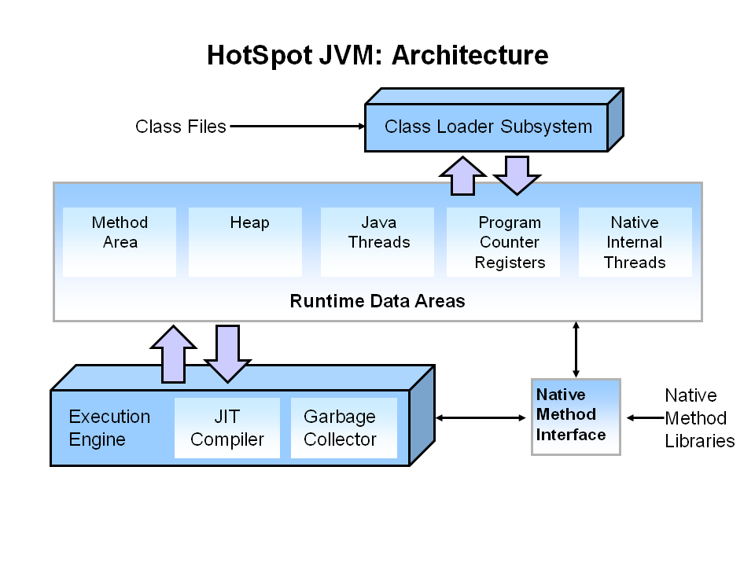

# JVM

这篇描述的内容都是针对 **HotSpot** 这一种 JVM 实现来说的。HotSpot 最初并非有 Sun 公司开发，而是由一家名为“Longview Technologies”的小公司设计的，1997 年被 Sun 收购。类似的 JVM 实现还有：

- BEA JRockit
- IMB J9
- Microsoft JVM
- Apache Harmony
- Google Android Dalvik

### 垃圾回收器

- Serial: 串行回收，单线程，停所有其他线程
- Parallel Scavenge = PS: 并行回收，多线程，无法配合CMS
- ParNew：改进版 PS，可配合 CMS
- SerialOld：老年代专用
- ParallelOld：老年代专用
- CMS = Concurrent Mark Sweep
  * 两次 stw
- G1:
  * 分小块（region）
  * 小块打上代际标识，新生代Y，老年代O，幸存区S，未分配
- ZGC:
  * Java 11 推出
  * stw 不超过 10ms, 益于其采用的着色指针和读屏障技术
  * 停顿时间不会随着堆的大小，或者活跃对象的大小而增加
  * 支持8MB~4TB级别的堆（未来支持16TB）
- Shenandoah:
- Epsilon: No-op，调试专用

### JVM 内存布局

- 和使用的垃圾回收器有关
- 不要和 JMM 弄混淆（Java 内存模型）
- 虚拟机栈

### 对象的内存布局

### 优化思路

- 减少 FullGC，缩短 stw

### 安全点 Safepoint

- 可暂停，stw 终止所有线程 = 等待所有线程都运行到安全点
- 存在轮询 polling: 细节？
  * Between any 2 bytecodes while running in the interpreter (effectively)
  * On ‘non-counted’ loop back edge in C1/C2 compiled code
  * Method entry/exit (entry for Zing, exit for OpenJDK) in C1/C2 compiled code. Note that the compiler will remove these safepoint polls when methods are inlined.
  * `-XX:+PrintAssembly` 选项可以查看 safepoint polls，具体是汇编指令注释中有 `{poll}` 和 `poll return`
- 生成的汇编语言中safepoint其实是一个test命令。test指向的是一个特殊的内存页面地址，当JVM需要所有的线程都执行到safepint的时候，就会对该页面做一个标记。从而通知所有的线程。
- 字节码插入位置
- mprotect 系统调用

### 内存页

- linux scheduler starvation problem
- page trap spinning

### 即时编译 JIT (Just-in-time)

- 自动查找性能热点并进行动态优化，这也是HotSpot名字的由来
- Java 1.1 就已存在
- C1/C2 编译器 (client/server)
- 热点方法，循环热点
- 优化方法: 内联优化, 逃逸分析, 循环优化, 向量优化，指令优化

### invokedynamic

- Java 7 加入
- 其他类似的指令还有:
  * invokespecial
  * invokestatic
  * invokevirtual
  * invokeinterface

### 其他

- synchronized 性能优化 6
- lambda mapreduce 8
- AOT (Ahead-of-time) 9 removed 16
