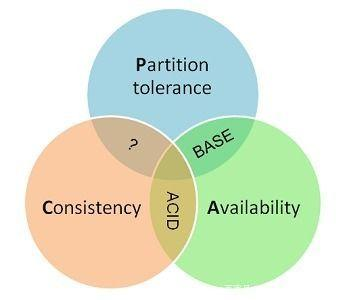

### 一致性算法（共识算法）
- 强：paxos：basic 版本 proposal, client, propser, acceptor, learner, 潜在问题-活锁, 还没等到上一个提案达到多数派下一个提案又来了；multi 版本 整个系统只有一个Proposer，称之为Leader
- 强：zab（改进 paxos，muti-paxos）与 raft 类似，对于Leader的任期，raft叫做term，而ZAB叫做epoch，在状态复制的过程中，raft的心跳从Leader向Follower发送，而ZAB则相反。
- 强：raft（选举型的主从同步，muti-paxos）leader，follower，candidate
- 弱：dns
- 弱：gossip：没有角色之分，流言

### 分布式锁

### 分布式事务
- （强一致) xa 2pc 准备阶段，提交阶段 AP 应用程序，RM 资源管理器，TM 事务管理器。资源锁需要等到两个阶段结束才释放，性能较差。
- （强一致）3pc 阿里 seata 引入 TC 事务协调器，用于先获取一个事务 ID
- 线性提交，线性回滚 saga 
- （最终一致）柔性 tcc (try, commit, cancel) 幂等
- （最终一致）可靠消息一致性：消息的可靠性关键由发起通知方来保证，本地消息表
- （最终一致）最大努力通知（mq，ack) ：通知的可靠性关键在接收通知方。最大努力通知是最简单的一种柔性事务，适用于一些最终一致性时间敏感度低的业务，且被动方处理结果不影响主动方的处理结果。需要实现消息的重发通知机制和消息校对机制。当消息无法被接收方接收时，由接收方主动查询消息（业务处理结果）

### CAP 和 BASE 理论

- Consistency 一致性
- Availability 可用性
- Partition tolerance 分区容错性
- BASE 是对一致性的扩展，Bascically Available 基本可用，Soft state 软状态，Eventally consistent 最终一致性
- 通过牺牲强一致性来获得可用性，BASE 是柔性事务的理论基础

举出 CP，AP，CA 的例子

### 分布式框架

- seata
- zookeeper

### 软件事务内存（STM）

### 脑裂（split-brain）

集群选举出两个 leader，出现不一致。解决方法：

- 选举法
paxos 只有集群中超过半数节点投票才能选举出Leader。ZooKeeper默认采用了这种方式。但是它的限制也很明显就是如果出现过半的机器宕机，会导致整个集群无法正常提供服务
- 冗余通信（Redundant communications）
顾名思义，冗余通信的方式来保证通信的高可用性，避免出现分区
- 隔离（fencing）
引入公共共享资源，第三方存储。例如：数据库（当然还可以选其他存储：redis、zk等）维护leader信息
leader选举成功维护一条数据库数据，表明自身为leader，对该数据的读写以串行的方式保证并发安全性
如果follower与leader失联，尝试选举自身为leader，结果发现数据库中已经有leader存在
通过RPC、ssh等等方式执行已经存在的leader服务器上的方法终止老leader进程，如果成功则更新leader为自身
隔离的方式也采用了冗余通信的方式，如果远程终止leader进程的调用失败，则集群也会持续处于不可用状态

- HDFS脑裂问题选用的为：隔离方案
- Zookeeper脑裂问题选用的为：选举法（过半概念），ZAB（zookeeper atomic broadcast）

### Raft 

- http://thesecretlivesofdata.com/raft/
- 类似主从，但是主通过选举产生
- node state: follower, candidate, leader

### 分布式存储

- NAS：Network Attached Storage
- SAN：Storage Area Network

